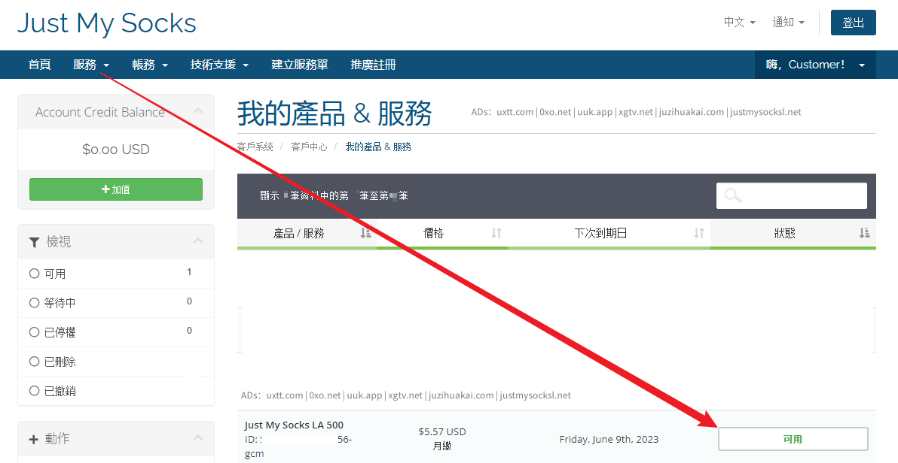
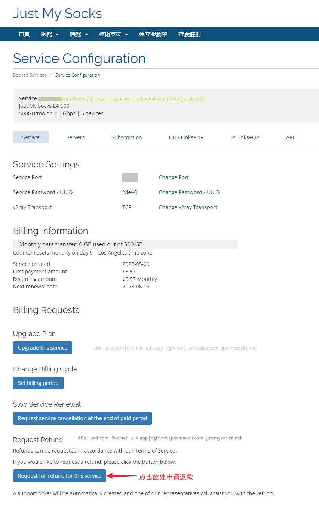

# Just My Socks 怎么退款

如果不满意 Just My Socks 机场服务，可以申请JMS退款。

## JMS退款条件

客户满足以下所有条件，可以申请全额退款：

<ol>
    <li>客户账户信誉良好，没有违反服务条款</li>
    <li>以前没有任何付款或目前有争议</li>
    <li>每月数据传输使用率低于10％</li>
    <li>该帐户是在7天内或更短的时间前创建</li>
    <li>客户未使用其他账户退款权利</li>
</ol>

退款按原付款方式退回，退款处理后，帐户可用于未来订单，但不再有退款资格。

JMS官方 Cancellations and Refunds 说明原文（<a href="https://justmysocks3.net/members/index.php?rp=/knowledgebase/1/Terms-of-Service.html" rel="nofollow" target="_blank">Terms of Service</a>）：

Customer may cancel services at any time in the billing control panel.

Customer may request a full refund for service provided all of the following conditions are met:

<ol>
    <li>Customer’s account is in good standing and there have been no violations of Terms of Services </li>
    <li>None of the payments have been previously or currently disputed </li>
    <li>Monthly data transfer usage is under 10% </li>
    <li>Customer’s account was created 7 or fewer days ago </li>
    <li>Client had not used the right to Refund previously under current or different account  </li>
</ol>

Refunds are issued to the original form of payment.

After the refund is processed, account may be used for future orders, however it will not be eligible for further refunds.

## JMS申请退款方法

打开<a href="https://justmysocksl.net/168-just-0" target="_blank">Just My Socks 网站</a>，然后在 Just My Socks 官网菜单，选择 Services => My Services

即可看到已购买JMS服务信息，Status 显示 <code>Active</code>或可用，即为当前可用。

点击需要申请退款的服务，进入详情页面：

然后点击一下 <code>Request full refund for this service</code> 按钮即可申请退款。退款方式是原路退回，比如使用支付宝付款，那么退款到支付宝。
